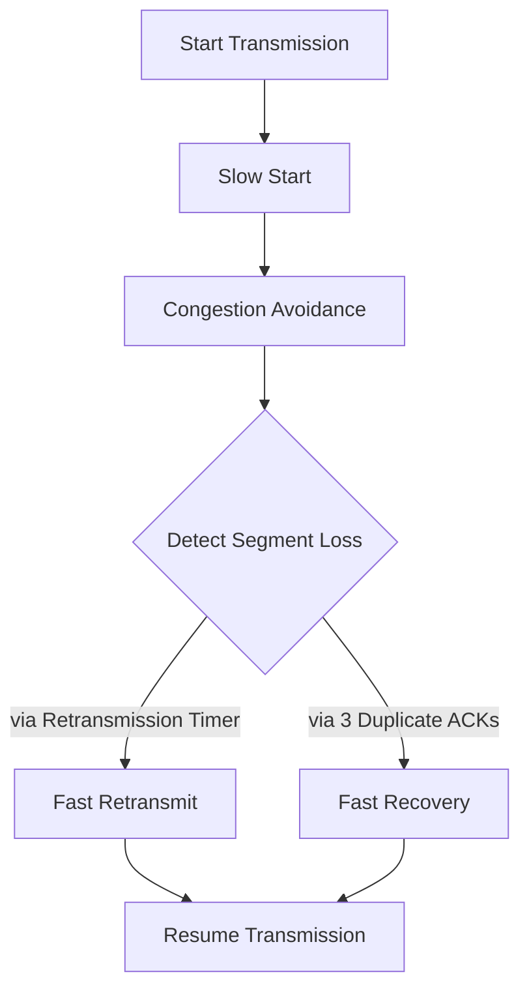
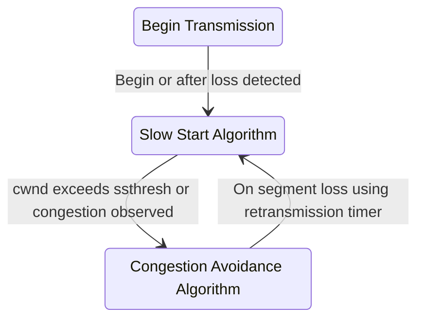
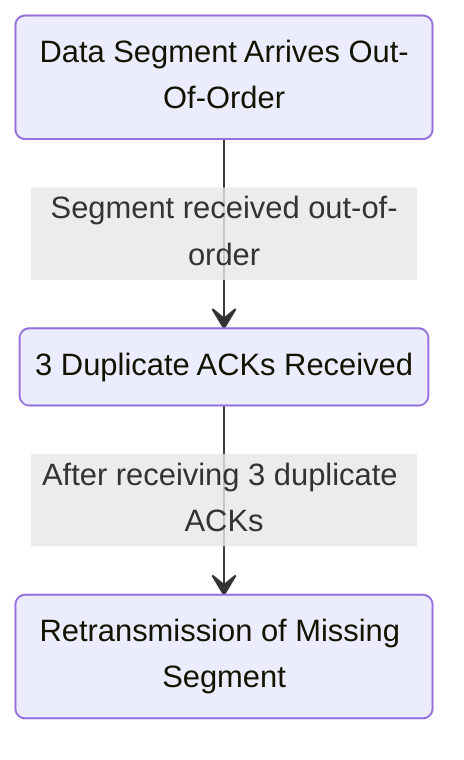
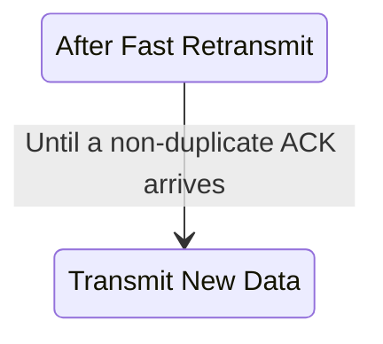
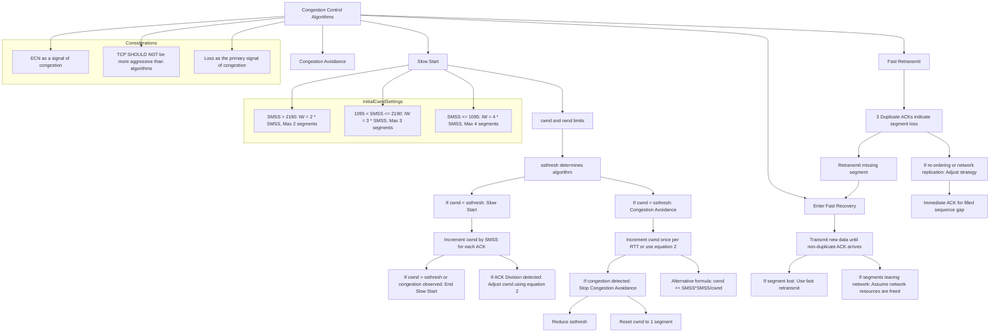

https://datatracker.ietf.org/doc/html/rfc5681
https://datatracker.ietf.org/doc/html/rfc9438

```mermaid
  graph TD;
    A[Start Transmission] --> B[Slow Start];
    B --> C[Congestion Avoidance];
    C --> D{Detect Segment Loss};
    D --> |via Retransmission Timer| E[Fast Retransmit];
    D --> |via 3 Duplicate ACKs| F[Fast Recovery];
    E --> G[Resume Transmission];
    F --> G;

```

```mermaid
stateDiagram-v2
    state "Begin Transmission" as A
    state "Slow Start Algorithm" as B
    state "Congestion Avoidance Algorithm" as C

    A --> B: Begin or after loss detected
    B --> C: cwnd exceeds ssthresh or congestion observed
    C --> B: On segment loss using retransmission timer

```

```mermaid
stateDiagram-v2
    state "Data Segment Arrives Out-Of-Order" as A
    state "3 Duplicate ACKs Received" as B
    state "Retransmission of Missing Segment" as C

    A --> B: Segment received out-of-order
    B --> C: After receiving 3 duplicate ACKs

```

```mermaid
stateDiagram-v2
    state "After Fast Retransmit" as A
    state "Transmit New Data" as B

    A --> B: Until a non-duplicate ACK arrives

```

```mermaid
   graph TB
    A[Congestion Control Algorithms] --> B[Slow Start]
    A --> C[Congestion Avoidance]
    A --> D[Fast Retransmit]
    A --> E[Fast Recovery]
    
    B --> F[cwnd and rwnd limits]
    F --> G[ssthresh determines algorithm]
    G --> H1[If cwnd < ssthresh: Slow Start]
    G --> H2[If cwnd > ssthresh: Congestion Avoidance]
    H1 --> I[Increment cwnd by SMSS for each ACK]
    I --> J1[If cwnd > ssthresh or congestion observed: End Slow Start]
    I --> J2[If ACK Division detected: Adjust cwnd using equation 2]
    H2 --> K[Increment cwnd once per RTT or use equation 2]
    K --> L1[If congestion detected: Stop Congestion Avoidance]
    K --> L2[Alternative formula: cwnd += SMSS*SMSS/cwnd]
    
    D --> M[3 Duplicate ACKs indicate segment loss]
    M --> N[Retransmit missing segment]
    N --> E[Enter Fast Recovery]
    
    E --> O[Transmit new data until non-duplicate ACK arrives]
    O --> P1[If segment lost: Use fast retransmit]
    O --> P2[If segments leaving network: Assume network resources are freed]
    
    L1 --> Q[Reduce ssthresh]
    L1 --> R[Reset cwnd to 1 segment]
    
    M --> S[If re-ordering or network replication: Adjust strategy]
    S --> T[Immediate ACK for filled sequence gap]

    %% Additional considerations
    subgraph Considerations
        AA[ECN as a signal of congestion]
        BB[TCP SHOULD NOT be more aggressive than algorithms]
        CC[Loss as the primary signal of congestion]
    end
    
    A --> AA
    A --> BB
    A --> CC

    %% Initial cwnd considerations
    subgraph InitialCwndSettings
        Z1[SMSS > 2190: IW = 2 * SMSS, Max 2 segments]
        Z2[1095 < SMSS <= 2190: IW = 3 * SMSS, Max 3 segments]
        Z3[SMSS <= 1095: IW = 4 * SMSS, Max 4 segments]
    end
    
    B --> Z1
    B --> Z2
    B --> Z3

```

```mermaid
  graph TB

    A[Congestion Control Algorithms]
    B[Slow Start & Congestion Avoidance]
    C[Fast Retransmit/Fast Recovery]

    %% Congestion Control Algorithms
    A -->|Specified in terms of loss as signal| D[Use of loss as the signal of congestion]
    A -->|Alternative| E[Explicit Congestion Notification ECN - RFC3168]

    %% Slow Start & Congestion Avoidance
    B -->|Control| F[Control the amount of outstanding data in the network]
    B -->|Variables| G[Congestion window cwnd]
    B -->|Variables| H[Receiver's advertised window rwnd]
    B -->|Variables| I[Slow start threshold ssthresh]
    B -->|Condition| J[When cwnd < ssthresh: Use Slow Start]
    B -->|Condition| K[When cwnd > ssthresh: Use Congestion Avoidance]
    B -->|Condition| L[When cwnd = ssthresh: Either Slow Start or Congestion Avoidance]
    B -->|During Slow Start| M[Increment cwnd by at most SMSS bytes for each ACK received]
    B -->|During Congestion Avoidance| N[Increment cwnd by 1 full-sized segment per RTT]
    
    %% Fast Retransmit/Fast Recovery
    C -->|Action| O[Send immediate duplicate ACK on out-of-order segment arrival]
    C -->|Causes| P[Dropped segments]
    C -->|Causes| Q[Re-ordering of data segments by the network]
    C -->|Causes| R[Replication of ACK or data segments by the network]
    C -->|Fast Retransmit| S[Uses 3 duplicate ACKs to indicate segment loss]
    C -->|Fast Recovery| T[Governs transmission of new data until a non-duplicate ACK arrives]
    
    %% Details and Relationships
    G -->|Governed by| H[The minimum of cwnd and rwnd governs data transmission]
    I -->|Determines Algorithm| L[Used to determine algorithm]
    M -->|End Condition| U[Ends when cwnd > ssthresh or congestion is observed]
    N -->|Guidelines| V[MAY increment by SMSS bytes]
    N -->|Guidelines| W[SHOULD increment once per RTT]
    N -->|Guidelines| X[MUST NOT increment by more than SMSS bytes]
    S -->|Action| Y[Retransmit the missing segment without waiting for the retransmission timer]


```
